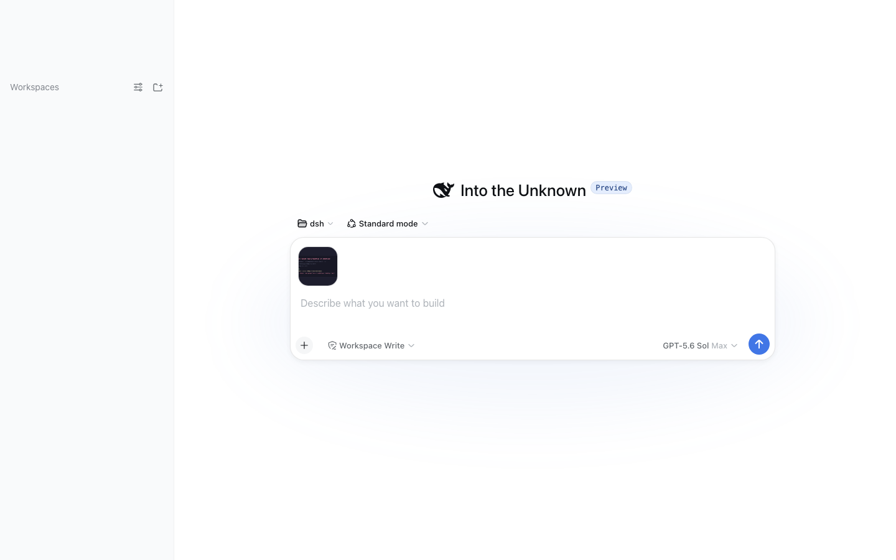
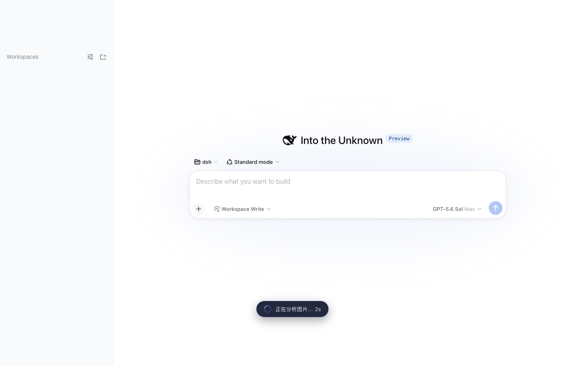
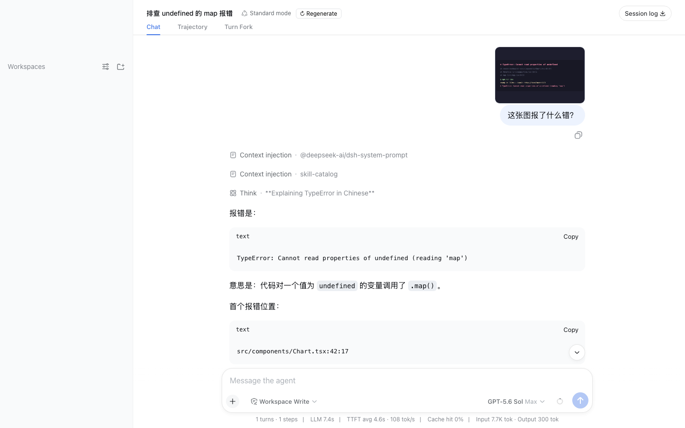
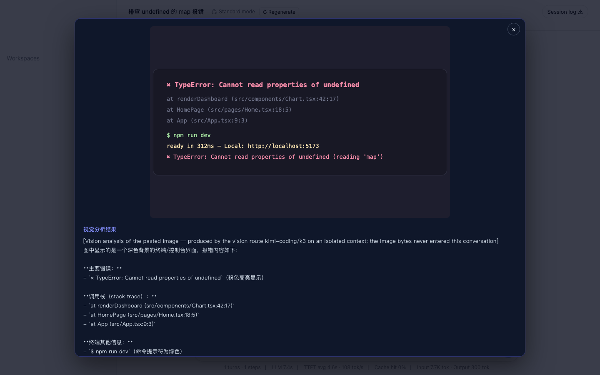

# dsh-vision-subagent

给纯文本模型的 DeepSeek Harness 装上眼睛：把读图任务交给一个跑在**独立视觉路由**（MiniMax / Kimi / 任意 OpenAI 兼容供应商）上的**一次性子代理**。图片字节和视觉模型的中间上下文**不会进入主会话**，主模型只收到最终的文字结论。

## 为什么是子代理

- **上下文隔离**：大图 / 多图对比不再占用主模型窗口，只有蒸馏后的文本返回
- **多轮视觉推理**：子代理可以自己调用 read_image 看更多工作区文件、反复比对后再给结论
- **成本与路由分离**：视觉调用走 MiniMax/Kimi 路由单独结算，主模型只负责推理

## 快速开始

`sh
# 1. 安装到 web profile（本地 checkout / npm 包均可）
dsh plugin --profile web add /path/to/dsh-vision-subagent
# 或发布后：dsh plugin --profile web add dsh-vision-subagent

# 2. 配置视觉路由（编辑 ~/.dsh/profiles/web/cordis.patch.yml）
`

`yaml
- insert:
    - id: vision-subagent
      name: 'dsh-vision-subagent'
      config:
        provider: kimi-coding   # 或 minimax-cn / 自定义路由
        model: k3               # 或 MiniMax-M3 / MiniMax-VL-01
`

`sh
# 3. 重启 dsh web，开新会话后对模型说：
#   '看下 ~/Desktop/error.png 是什么报错'
# 模型会自主调用 vision_agent(images=[...], question=...)
`

## 效果展示

| 贴图提问 | 分析中 | 干净的气泡 | 灯箱详情 |
| --- | --- | --- | --- |
|  |  |  |  |

## 输入框直接粘贴图片（Codex 式）

安装后，Web 输入框原生支持粘贴/拖入图片。发送时，client 插件会先把图片上传给插件的主机端点：

1. 主机校验会话、把图片存成持久附件（大小/类型受部署限额约束）
2. 视觉路由在**独立上下文**完成一次分析（图片字节不进主会话），并且**以你的消息草稿为意图导向**——报错截图就聚焦错误文字与堆栈，穿搭问题就聚焦服装细节，而不是泛泛描述一切
3. 只有分析文本随你的消息一起发给主模型——主模型直接回答，不需要再调工具

聊天记录里你的气泡只显示你自己的文字和缩略图；分析内容收在点击缩略图打开的灯箱里，不会在气泡内重复展示。后续需要原图（图片编辑、像素级检查）时，持久消息里的附件链接可让模型调用 `vision_image_fetch` 把全保真原文件物化到工作区 `.dsh-vision/` 目录。

分析失败（超时/路由故障）时消息不会发送，输入框草稿原样保留。这个通道与 vision_agent 工具互补：粘贴图片走自动分析，工作区已有文件由模型自主调用工具读取。

## MiniMax / Kimi 视觉模型速查

| 供应商 | baseURL | 视觉模型 | key 环境变量 |
| --- | --- | --- | --- |
| Kimi（月之暗面） | https://api.moonshot.cn/v1 | k3 / kimi-k3 / moonshot-v1-8k-vision-preview | MOONSHOT_API_KEY |
| MiniMax | https://api.minimaxi.com/v1 | MiniMax-VL-01 | MINIMAX_API_KEY |
| MiniMax 国内 | （llm-pi-ai 内置 minimax-cn 路由） | MiniMax-M3 | MINIMAX_CN_API_KEY |

两条路线：

- **已有 llm-pi-ai 路由**（推荐）：在 Settings/Models 里已有 kimi-coding 或 minimax-cn 时，插件配置只需 provider + model，key 走该路由的凭据引用，插件自身永远不接触密钥。
- **手写声明路由**：在 llm-pi-ai 配置里新增一条 OpenAI 兼容路由（api: openai-completions + baseURL + apiKeyEnv + models），然后把 provider/model 指过去。

## 配置项（全部有默认值）

| 字段 | 默认 | 说明 |
| --- | --- | --- |
| enabled | true | 总开关；关闭后工具仍在但拒绝执行 |
| provider / model | 空（休眠） | 视觉路由；两者必须成对设置 |
| subagentProvider | spawn | ctx.subagents 提供方 |
| maxDepth | 1 | 子代理的绝对委托深度上限；1 = 视觉子代理可运行但禁止继续委托（0 会连子代理本身都拒绝——顶层 agent 的子代理深度即为 1） |
| maxImages | 4 | 每次调用图片数上限 |
| maxImageBytes | 10 MiB | 单图字节上限 |
| maxPromptChars | 8000 | question 长度上限 |
| maxOutputChars | 32000 | 返回文本截断长度 |
| allowRemoteUrls | false | 是否允许 http(s) 图片 URL（v0.1 保留字段，仅本地路径） |
| allowOutsideWorkspace | false | 是否允许工作区外的本地图片 |
| extraAllowedRoots | [] | 额外允许的图片根目录 |
| guidance | 空 | 追加给子代理的额外指令 |

## 安全模型

- 密钥只存在于视觉路由的凭据引用（环境变量）中，插件配置不接受明文 key，也不会把 key 写进任何日志或会话
- 本地图片默认限制在会话工作区内；符号链接被拒绝；读取有字节上限（取配置与部署限额的较小值）
- 子代理默认 maxDepth: 1（可运行，但禁止继续委托）；指令中明确禁止修改文件与执行 shell
- `vision_image_fetch` 只在会话工作区的 `.dsh-vision/` 下写入自生成的内容哈希文件名，任何调用方可控的路径片段都不会落盘

## 架构

`
主模型（纯文本）
   └─ vision_agent(images, question) ──┐
        │ 1. 路径准入：扩展名/工作区包含/符号链接/字节上限
        │ 2. ctx.attachments.saveImage → 内容寻址的持久引用
        │ 3. ctx.subagents.start('spawn', { agentOptions: {provider, model} })
        ▼
一次性子代理（MiniMax/Kimi 视觉路由，独立上下文）
   └─ 最终文本 ──► 主会话（仅此一条消息进入主上下文）
`

插件对 harness 服务只做结构化解构（duck-typing），对 rc 版本不敏感；运行时依赖仅 @deepseek-ai/dsh-tools（defineTool）与 @deepseek-ai/schemastery（配置 schema）。

## 路线图

- [x] Web 粘贴桥：composer 贴图自动触发视觉分析（v0.2）
- [x] 贴图分析意图感知：消息草稿引导视觉聚焦；气泡保持干净（v0.3）
- [x] `vision_image_fetch`：把贴图原图物化到 `.dsh-vision/` 供编辑（v0.3）
- [ ] Settings 面板（可视化选择 provider/model）
- [ ] 远程图片 URL 支持（受控 fetch + 大小上限）
- [ ] 内嵌 SKILL.md：教主模型何时该委托读图

## 开发

`sh
npm install && npm run typecheck && npm test && npm run build
`

发布前把 dependencies / devDependencies 中的 @deepseek-ai/* 版本与目标 harness rc 对齐（当前运行时依赖 rc.6，peer 范围 >=rc.5 <0.1.0，兼容本地 rc.5 checkout）。

## License

MIT
